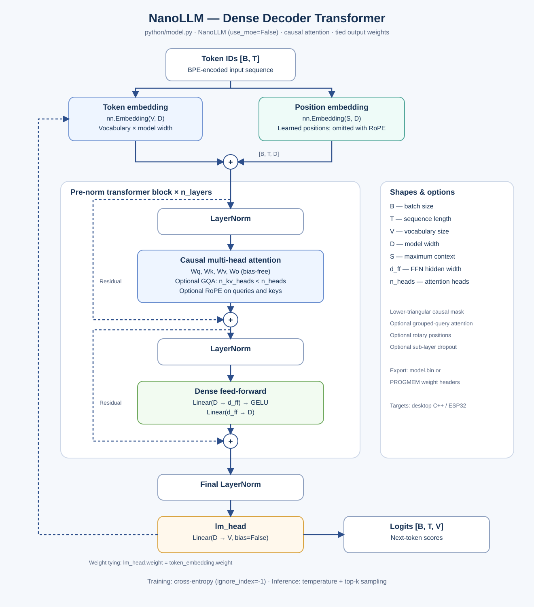
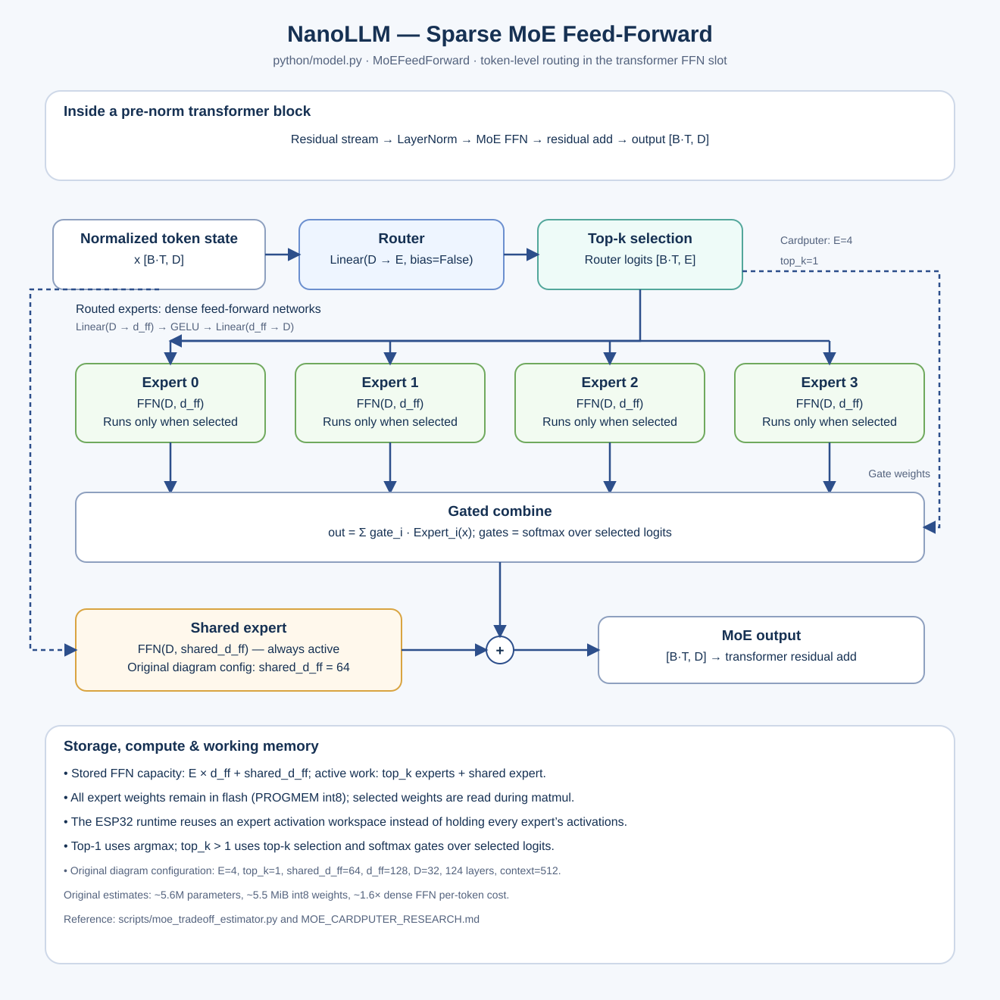

# NanoLLM — Ultra-Compact LLMs for Microcontrollers

NanoLLM is an end-to-end pipeline for training tiny language models and running them locally on microcontrollers, tested on the ESP32-S3-based M5Stack Cardputer.

Running a transformer on a handheld device means working within tight memory and processing limits. The ESP32-S3 has a dual-core processor running at up to 240 MHz and just 512 KiB of internal SRAM, which must also support the firmware, display, and runtime. The target Cardputer has no PSRAM, leaving roughly 200 KiB for inference buffers. Even a small model with a few million parameters exceeds this RAM budget, while repeated matrix operations make token generation computationally demanding.

NanoLLM addresses these constraints by separating **model storage** from **working memory**. Model weights are quantized to int8 and embedded in the Cardputer’s nonvolatile flash memory through `PROGMEM`. The runtime accesses these weights without copying the full model into RAM, reserving SRAM for activations and temporary buffers. Compact model dimensions, bounded context lengths, and a sparse mixture-of-experts architecture further control memory use and per-token computation: each MoE block evaluates one selected expert alongside an always-on shared expert.

The validated Cardputer configuration contains approximately **4.66 million parameters**, with about **4.45 MiB of int8 weights** stored in flash and **191 KiB of working RAM**. Flash makes it possible to store a model far larger than SRAM can hold; available RAM and processor throughput still determine its practical context length, width, and generation speed.

The pipeline connects **PyTorch training → int8 export → desktop C++ inference → ESP32-S3 firmware**, with cross-runtime verification to check consistent behavior from training to deployment.


Python training (PyTorch) → int8 export → desktop C++
inference → ESP32-S3 firmware with weights stored in flash. The default
Cardputer model is a **~5.6 M-parameter mixture-of-experts transformer** that fits
in a ~7 MiB app partition while using only ~200 KiB of working RAM.

```
┌──────────────┐    model.bin /    ┌─────────────────┐    PROGMEM      ┌──────────────────────┐
│  Python      │    PROGMEM .h     │  Desktop C++    │                 │  ESP32-S3 Cardputer  │
│  train (GPU) │ ────────────────▶ │  inference (x86)│                 │  M5Stack Cardputer   │
│  BPE tokenizer│   model_config   │  int8 runtime   │                 │  flash-backed int8   │
└──────────────┘                   └─────────────────┘                 └──────────────────────┘
        │ cross-runtime parity (Python quantized runtime vs C++ vs ESP32, verified over serial)
```

## Architectures

NanoLLM provides two model families for **text generation** that share common building blocks and export tooling: a dense causal transformer as a simple baseline, and a sparse mixture-of-experts (MoE) transformer — the Cardputer default — that adds parameter capacity while keeping per-token computation bounded.

| Architecture | How it works | Microcontroller use cases | Code | Diagram |
|---|---|---|---|---|
| **Dense decoder** | A causal transformer that generates text one token at a time. Uses pre-norm attention and GELU feed-forward blocks, with tied input/output embeddings. Supports optional RoPE and grouped-query attention. | **Small chatbots and text interfaces:** answer short questions, generate brief status explanations, or interpret commands through a conversational interface. Provides a straightforward baseline for evaluating model size, memory use, and response quality. | [`python/model.py`](python/model.py) | [](docs/architecture_dense_transformer.svg) |
| **Sparse MoE decoder — Cardputer default** | Uses the same generative backbone, but replaces the feed-forward blocks with a sparse mixture of experts. Each token activates one of four routed experts plus an always-on shared expert, increasing parameter capacity while limiting the computation and activation memory used per token. | **Chatbots with greater model capacity:** support a handheld assistant covering several topics or command types within a constrained compute budget. Expert selection is learned during training; experts are not necessarily assigned to specific tasks. All expert weights still consume flash storage. | [`MoEFeedForward`](python/model.py) | [](docs/architecture_moe_ffn.svg) |

### Choosing a model

- **For a chatbot or natural-language response, use a decoder.** Start with the dense model for simplicity, or use sparse MoE when additional parameter capacity fits the available flash budget.

<details>
<summary><b>Dense transformer</b> — click to expand</summary>

</details>

<details>
<summary><b>MoE feed-forward block</b> — click to expand</summary>

</details>

## Repository layout

```
nanollm/
├── python/            # PyTorch training, tokenizer, int8 export, quantized runtimes
│   ├── model.py       #   dense + MoE transformer
│   ├── train.py       #   pretraining / SFT (dense & MoE)
│   ├── tokenizer.py   #   BPE (compatible with both C++ runtimes)
│   ├── quantize.py / quantized_runtime.py   # int8 export + Python parity runtime
│   ├── export_weights.py / export_weights_header.py / export_vocab_header.py
│   └── gradio_app.py  #   quick web chat UI for checkpoints
├── cpp/               # Desktop (x86) int8 inference, CMake
│   └── model.cpp/h, bpe_tokenizer.cpp, inference.cpp, test_inference.cpp
├── esp32_m5stack/     # PlatformIO firmware: chat UI, serial verify, embedded weights
│   ├── src/model_esp32.cpp, model_embedded.cpp, bpe_tokenizer_esp32.cpp, chat_interface.cpp
│   └── partitions_embedded.csv               # ~7 MiB factory app partition
├── scripts/           # Dataset prep, MoE pipeline, sizing estimator, serial verification
├── docs/              # Architecture SVG diagrams + design notes
└── releases/          # Pinned, reproducible release artifacts
```

## Quick start

### 0. Interactive launcher (recommended)

`scripts/nanollm_tui.py` is a terminal UI that drives the whole lifecycle —
dataset download, pretrain, SFT, post-train (int8 export + PROGMEM embed +
sanity eval), firmware build/flash, and verification — for either target:

```bash
python scripts/nanollm_tui.py                      # TUI (curses, stdlib only)
python scripts/nanollm_tui.py --dry-run            # show the exact commands
python scripts/nanollm_tui.py --target pc_gpu --profile desktop   # GPU-PC model
python scripts/nanollm_tui.py --target cardputer --profile cardputer-mqa-ctx224
python scripts/nanollm_tui.py --run datasets --yes # headless: one stage at a time
```

Pick a target (`pc_gpu` or `cardputer`), a profile, and optional model/training
overrides; the TUI sizes the model against the target's flash/RAM budget before
you commit to a run. Firmware flashing is explicit: set `UPLOAD_PORT` in the
Config screen to flash (the build step always runs, the flash step only when you
name a port).

### 1. Train

```bash
python -m venv .venv && source .venv/bin/activate
pip install -r requirements.txt

# Tiny smoke model (minutes, CPU or GPU)
./scripts/train_moe_pipeline.sh --profile quick
```

### 2. Export for C++ / ESP32

```bash
python python/export_weights.py --checkpoint checkpoints/<run>/model_best.pt \
    --output weights/model.bin --allow-moe-export
python python/export_weights_header.py --checkpoint checkpoints/<run>/model_best.pt \
    --output esp32_m5stack/src/model_weights.h
python python/export_vocab_header.py --tokenizer checkpoints/<run>/tokenizer/tokenizer.json \
    --output esp32_m5stack/src/vocab_weights.h
```

### 3. Desktop C++ inference

```bash
cmake -S cpp -B cpp/build && cmake --build cpp/build
./cpp/build/inference weights/model.bin "hello"
```

### 4. Flash the Cardputer

```bash
./scripts/train_moe_pipeline.sh --export      # train + embed PROGMEM weights & vocab
cd esp32_m5stack && pio run -e m5stack_cardputer_nopsram -t upload
python scripts/verify_cardputer_serial.py --reset \
    --checkpoint checkpoints/<run>/model_best.pt
```

A **full pipeline in one command** (pretrain on FineWeb → chat fine-tune → export →
PROGMEM embed) is `./scripts/train_moe_pipeline.sh --export`; use `--profile quick`
for a fast smoke test. See [QUICKSTART.md](QUICKSTART.md) for step-by-step details.

## Cardputer footprint (validated config)

| Resource | Value | Budget |
|---|---|---|
| Config | vocab 2048 · d_model 80 · 18 layers · 4 heads (MQA) · 4 experts top-1 + shared(160) · ctx 224 | — |
| Params | 4,661,760 | — |
| int8 weights (PROGMEM) | ~4.45 MiB | ~7 MiB app partition (`partitions_embedded.csv`) |
| Vocab strings (PROGMEM) | flash, decode-only | included above |
| Working RAM | ~191 KiB | ~200 KiB (float32 activations; weights never leave flash) |

Working-memory model: `working_bytes ≈ 4 × (3·S·D + 3·D + S + V)`. The streamed
LM-head argmax removes the full-vocab logits buffer, but the `3 · S · D`
residual/attention buffers are what cap `d_model` — RAM, not flash, is the
binding constraint for wider vocab or longer context.

Re-size any candidate before training:

```bash
python scripts/moe_tradeoff_estimator.py --cardputer-optimal
python scripts/moe_tradeoff_estimator.py --cardputer-max-flash
```

Memory layout and buffer-by-buffer breakdown: [ESP32 M5Stack README](esp32_m5stack/README.md)
and [MoE Cardputer Research](MOE_CARDPUTER_RESEARCH.md).

## Released model card — `cardputer_mqa_ctx224_chat_v1`

The pinned release under [`releases/cardputer_mqa_ctx224_chat_v1/`](releases/cardputer_mqa_ctx224_chat_v1/README.md)
is the model this README's numbers refer to.

| Field | Value |
|---|---|
| Release tag | `cardputer_mqa_ctx224_chat_v1` (variant `chat`) |
| Source commit | `984b6de` |
| Architecture | vocab 2048 · d_model 80 · 18 layers · 4 heads, MQA (n_kv_heads 1) · 4 experts top-1 + shared FFN (160) · d_ff 320 · ctx 224 |
| Params | 4,661,760 (int8: 4.45 MiB PROGMEM) |
| Foundation | FineWeb `sample-10BT` 3× pretrain (`foundation/model_pretrain.pt`, 5 epochs, val_loss 3.38) |
| Fine-tune | `science_boost_v2_60x` recipe on Qwen3.5-distilled 3k chat, seed 44 (best val_loss 3.14) |
| Tokenizer | pinned 2048-vocab BPE (1,837 merges), committed under `releases/` |

### Measured performance (reproduced)

Every number below was **re-run from the pinned release checkpoint** (SHA-pinned
`chat/model_best.pt`) with the public harnesses in this repo. Reproduction date:
2026-10-02.

**Frozen capability suite** (`data/eval/clean_transfer_v1.json`, 25 held-out cases,
greedy decode — suite was frozen 2026-07-13 and is excluded from training data by
overlap audit):

| Score | Value | Categories |
|---|---|---|
| Clean-transfer aggregate | **0.72** | greeting 1.0 · factual 0.8 · science 0.8 · arithmetic 0.6 · writing 0.4 |

Baseline for comparison: the same l18/seed-44 model *without* the science-boost
recipe scored 0.52 on this suite.

**Public zero-shot benchmarks** (`scripts/benchmark_public_llm.py`, greedy,
HuggingFace eval splits):

| Benchmark | Accuracy | Chance level |
|---|---|---|
| HellaSwag (10,042) | 26.59% | 20% (5-way) |
| ARC-Easy (570) | 28.25% | 25% (4-way) |
| ARC-Challenge (299) | 26.09% | 25% (4-way) |
| PIQA (1,838) | 53.59% | 50% (2-way) |
| WinoGrande (1,267) | 50.20% | 50% (2-way) |

These are near-chance for a 4.7 M-parameter model — they are published for
honesty, not as claims of competence. The model is sized for short
question/answer on a handheld, not general knowledge.

**Router diagnostics** (`scripts/router_diagnostics.py`, 2000 training tokens):
all 4 experts used (share 0.212–0.274), zero dead experts, load imbalance
(max−min) 0.062, normalized entropy 0.997 (≈ uniform routing).

**On-device serial parity** (`scripts/verify_cardputer_serial.py` against the
flashed release firmware): token-identical encode *and* next-token vs the Python
int8 runtime on all prompts.

### Inference performance (measured)

Latency was **re-measured on 2026-10-02** against the pinned release weights
(`releases/cardputer_mqa_ctx224_chat_v1/deploy/model.bin`, 4.45 MiB int8).
"Prefill" = time to process the prompt and emit the first token; "decode" =
steady-state per-token generation cost. Two runtimes are reported because they
use different decode strategies.

**Desktop C++** (`cpp/build/inference`, x86, `g++ -O2`, single core, int8):

| Metric | Value |
|---|---|
| Prefill (3 → 224 tokens) | ≈ 2.5 ms → ≈ 215 ms (≈ 1,000–1,400 tok/s) |
| Decode (shipped CLI: full re-forward each step, **no KV cache**) | ≈ 40 tok/s at short context, falling to single digits (≈ 2–8 tok/s) by ~128 tokens |

The shipped desktop `inference` binary re-runs the full forward pass over the
growing history for every new token (it deliberately mirrors the parity
reference rather than caching), so its per-token cost grows with context and
varies with host load. A KV-cached decode path (`decodeStep`, the same code the
ESP32 firmware runs) is available in `cpp/build/dump_cached_tokens` and keeps
decode cost roughly flat as context grows.

**Cardputer** (ESP32-S3 @ 240 MHz, int8 weights read from flash, KV-cached
decode, no PSRAM):

| Metric | Value |
|---|---|
| Time-to-first-token (TTFT, 3–4-token prompt) | ≈ 0.6–1.1 s |
| Steady-state decode | ≈ 1.5 tok/s (≈ 0.64 s/token) |

These are the honest numbers for a 4.7 M-parameter model on a 240 MHz MCU: the
device generates roughly one short reply every few seconds, which matches its
intended use (short Q&A and command interpretation on a handheld, not
free-form prose). Speed scales down further if you widen `d_model` or extend
context (see the [Cardputer footprint](#cardputer-footprint-validated-config)
tradeoff); it scales up with a faster clock, SIMD, or a denser (non-MoE) block.

Reproduce the desktop prefill/decode timings:

```bash
cmake -S cpp -B cpp/build && cmake --build cpp/build
./cpp/build/inference weights/model.bin weights/model_config.json \
    "The quick brown fox" 16      # prints prefill_ms + decode tok/s
```

Reproduce all of the above:

```bash
python scripts/eval_chat_checkpoint.py --greedy \
    --checkpoint releases/cardputer_mqa_ctx224_chat_v1/chat/model_best.pt \
    --cases-file data/eval/clean_transfer_v1.json
python scripts/benchmark_public_llm.py \
    --checkpoint releases/cardputer_mqa_ctx224_chat_v1/chat/model_best.pt
python scripts/verify_cardputer_serial.py --reset \
    --checkpoint releases/cardputer_mqa_ctx224_chat_v1/chat/model_best.pt \
    --weights releases/cardputer_mqa_ctx224_chat_v1/deploy/model.bin \
    --config releases/cardputer_mqa_ctx224_chat_v1/deploy/model_config.json
```

The Cardputer TTFT/decode figures require a device flashed with the release
firmware (`releases/cardputer_mqa_ctx224_chat_v1/deploy/firmware.bin`); the
verify script reports `latency_summary` (TTFT + per-token) in its JSON output.

## Datasets, provenance & preprocessing

Full disclosure of what the release model was trained on and how each corpus was
obtained, filtered, and shaped.

### 1. Pretraining: FineWeb (3× sample)

| | |
|---|---|
| Upstream | [`HuggingFaceFW/fineweb`](https://huggingface.co/datasets/HuggingFaceFW/fineweb), split `sample-10BT` (~10 B-token subset of FineWeb, a Common Crawl-derived corpus that is pre-filtered upstream for language, quality, and decontamination) |
| License | ODC-By 1.0 (attribution required) |
| Obtain | streamed via `python scripts/download_fineweb.py --split sample-10BT`; the 3× corpus is `baseline (74,400 docs) + 148,800 further docs`, deduplicated against the baseline (`scripts/prepare_scaled_training_data.py`) |
| Size used | 223,200 documents, `data/fineweb/fineweb_3x.txt` (≈ 661 MiB, 3.75 M lines) |
| Local preprocessing | none beyond FineWeb's upstream pipeline — documents are concatenated and packed into 224-token blocks at training time; no additional filtering, resampling, or editing |

### 2. Fine-tuning: Qwen3.5-distilled short chat (3,000 turns)

The SFT corpus `data/chat/teacher_distilled_qwen3_5_3k.txt` (3,000
`User:/Assistant:` turns, 670 KB, committed) was **generated, not scraped**:

| Step | Detail |
|---|---|
| Prompt source | user prompts only, from [`tatsu-lab/alpaca`](https://huggingface.co/datasets/tatsu-lab/alpaca) (CC BY-NC 4.0) — 18.5 MiB of raw Alpaca, `data/chat/alpaca.txt` |
| Teacher model | `Qwen/Qwen3.5-4B` from HuggingFace, greedy (`do_sample=False`), max 80 new tokens, under a fixed system prompt ("You are NanoLLM … at most 50 words …") that shapes the short-answer style the Cardputer model imitates |
| Selection | all capability-seed prompts kept, plus a deterministic (seed 42) diverse sample of Alpaca prompts ≤ 240 chars — no commercial or private data, no human-written answers |
| Reply cleaning | `scripts/distill_short_chat.py` strips thinking/special tokens, trims replies to ≤ 320 chars at a sentence boundary, dedupes by normalized prompt |
| Format | `User: …\nAssistant: …` records joined by blank lines (the repo's `chat_template` format), each record ending in the tokenizer EOS |

Because the prompts are Alpaca-derived (CC BY-NC 4.0), the distilled corpus is
intended for **research use**; redistributing it commercially would inherit
Alpaca's non-commercial restriction. The release repo commits it for
reproducibility; treat its reuse accordingly.

### 3. Fine-tune data preparation (`scripts/prepare_chat_data.py`)

Applied on top of the distilled corpus for every SFT run:

1. **Normalize** — `normalize_chat_corpus` coerces records into the canonical
   `User:/Assistant:` template.
2. **Filter** (`scripts/filter_chat_data.py`, `is_good_turn`) — drop turns with
   user < 4 or reply < 8 chars, user > 240 or reply > 320 chars, instruction
   noise phrases, generic prompt prefixes, replies with ≥ 3 numbered list items,
   ≥ 4 question marks, nested `user:`/`assistant:` markers, short MCQ patterns,
   and short-statement/long-answer mismatches.
3. **Dedupe** — normalized (user, reply) key.
4. **Split** — train/val split **by user-prompt cluster** (not by turn) so
   near-duplicate prompts cannot leak across the split.
5. **Seed injection** — the capability seed
   (`scripts/chat_capability_seed_science_boost_v2.txt`, 93 examples: 53 base
   capability + 40 held-out-safe factual/science/writing paraphrases) is repeated
   60× (`science_boost_v2_60x`) and prepended. The v2
   seed is held-out-safe: its paraphrases were audited against the frozen eval
   suite (threshold 0.8 similarity) so no training example overlaps a test case
   (`scripts/audit_chat_overlap.py` enforces this every run).

### 4. Evaluation data

- **Frozen suite** — `data/eval/clean_transfer_v1.json` (25 cases × 5
  categories), frozen 2026-07-13 with a `post_training_only` policy: it is
  excluded from all training data by the overlap audit above.
- **Public benchmarks** — HellaSwag, ARC-Easy/Challenge, PIQA, WinoGrande from
  HuggingFace eval datasets, run unmodified by
  `scripts/benchmark_public_llm.py`.

### 5. Upstream license summary

| Data | Upstream license | How it's used here |
|---|---|---|
| FineWeb `sample-10BT` | ODC-By 1.0 | pretraining (attribution given here) |
| Alpaca (`tatsu-lab/alpaca`) | CC BY-NC 4.0 | prompts only → teacher-distilled replies (research use) |
| Qwen/Qwen3.5-4B outputs | Qwen model terms (see HF model card) | teacher for distillation |
| HellaSwag / ARC / PIQA / WinoGrande | per-dataset eval licenses (HF) | evaluation only |

Regenerate everything from a fresh checkout:

```bash
python scripts/ensure_finetune_data.py --report   # status + exact commands
python scripts/download_fineweb.py --split sample-10BT --sample-size 74400
python scripts/download_chat_datasets.py --datasets alpaca
python scripts/distill_short_chat.py --source data/chat/alpaca.txt \
    --seed-data scripts/chat_capability_seed.txt --output data/chat/teacher_distilled.txt
python scripts/prepare_chat_data.py \
    --input data/chat/teacher_distilled.txt \
    --seed-data scripts/chat_capability_seed.txt \
    --train-output data/chat/chat_train.txt --val-output data/chat/chat_val.txt
python scripts/ensure_canonical_tokenizer.py      # bootstrap the pinned 2048-vocab BPE
```

## Training recipes

| Recipe | Command / notes |
|---|---|
| **Pretrain + chat fine-tune (default)** | `./scripts/train_moe_pipeline.sh --export` |
| **Instruction fine-tune** | `./scripts/train_moe_pipeline.sh --instruction-finetune --export` (uses `data/instruct/`, 10-category balanced seed) |
| **Science-boost SFT (pinned release recipe)** | `./scripts/train_science_boost_sft.sh` (held-out-safe 4-stage SFT + frozen-suite eval) |

Datasets regenerate from HuggingFace on a fresh checkout — the TUI's **datasets**
stage does this for you, or run the pieces directly:
`python scripts/ensure_finetune_data.py --report` (status + exact commands),
`--tiny` / `--3x` (FineWeb), `python scripts/download_chat_datasets.py` (Alpaca /
ShareGPT / WizardLM / OpenOrca), `python scripts/download_instruction_datasets.py`
(instruction data). The canonical 2048-vocab tokenizer is committed under
`releases/` and bootstrapped by `python scripts/ensure_canonical_tokenizer.py`.
Details in [scripts/README.md](scripts/README.md).

GPU tips (tiny models under-utilize a big GPU): `PRETRAIN_BATCH_SIZE=256`,
`CHAT_BATCH_SIZE=128`, `NUM_WORKERS=8`, `AMP=bf16`, `TF32=1`; scale LR linearly with
batch size. `torch.compile` is not worth it at this scale.

## Testing & parity

```bash
python test_end_to_end.py                            # train → export → Python + C++ inference
python scripts/compare_quantized_runtime.py          # Python int8 vs C++ int8 parity
python scripts/verify_cardputer_serial.py --reset    # device vs Python quantized runtime
cd cpp/build && ctest                                # C++ unit tests (test_inference)
```

## Documentation map

| Topic | Doc |
|---|---|
| Getting started | [QUICKSTART.md](QUICKSTART.md) |
| ESP32 build & flash | [docs/design/ESP32_DEPLOYMENT.md](docs/design/ESP32_DEPLOYMENT.md), [esp32_m5stack/README.md](esp32_m5stack/README.md) |
| PROGMEM embedding design | [docs/design/EMBEDDED_WEIGHTS_QUICKSTART.md](docs/design/EMBEDDED_WEIGHTS_QUICKSTART.md), [docs/design/EMBEDDED_WEIGHTS_DESIGN.md](docs/design/EMBEDDED_WEIGHTS_DESIGN.md) |
| MoE design & sizing | [docs/design/MOE_CARDPUTER_RESEARCH.md](docs/design/MOE_CARDPUTER_RESEARCH.md), [docs/design/MOE_EXPORT_EXPERIMENTAL.md](docs/design/MOE_EXPORT_EXPERIMENTAL.md) (binary layout) |
| Agent guidance | [AGENTS.md](AGENTS.md) |

## Features

- MoE transformer (FFN-only, top-1 + shared expert) — the Cardputer default
- Flash-backed PROGMEM int8 weights on Cardputer (~96% partition utilization)
- Int8 quantization with **cross-runtime parity** (Python / desktop C++ / ESP32)
- BPE tokenizer with identical behavior in Python and both C++ runtimes
- Mixed-precision (bf16/fp16) GPU training, memmapped token cache
- End-to-end + serial verification suite
- M5Stack Cardputer chat UI with on-device keyboard

## Hardware

- **Training**: NVIDIA GPU ≥ 8 GiB VRAM (RTX 3090 tested); CPU works for tiny models
- **Inference**: M5Stack Cardputer (ESP32-S3) — 8 MiB external flash, ~512 KiB SRAM, no PSRAM

## Contributing

See [AGENTS.md](AGENTS.md) for the invariants that must never break (weight tying,
tokenizer parity, export artifact contract, quantized binary order) and the
lockstep propagation rule for any new parameter or artifact (Python → C++ → ESP32 →
tests/docs).

## References

This project has been built using the references below as inspiration and guidance.

### Mixture-of-Experts architectures & scaling
- DeepSeekMoE: Towards Ultimate Expert Specialization in Mixture-of-Experts Language Models — [arXiv:2401.06066](https://arxiv.org/abs/2401.06066)
- Mixtral of Experts — [arXiv:2401.04088](https://arxiv.org/abs/2401.04088)
- Switch Transformers: Scaling to Trillion Parameter Models with Simple and Efficient Sparsity — [arXiv:2101.03961](https://arxiv.org/abs/2101.03961)
- QMoE: Practical Sub-1-Bit Compression of Trillion-Parameter Models — [arXiv:2310.16795](https://arxiv.org/abs/2310.16795)
- Auxiliary-Loss-Free Load Balancing Strategy for Mixture-of-Experts — [arXiv:2408.15664](https://arxiv.org/abs/2408.15664)

### On-device / edge MoE serving
- MobileMoE: Scaling On-Device Mixture of Experts — [arXiv:2605.27358](https://arxiv.org/abs/2605.27358)
- SwapMoE: Serving Off-the-Shelf MoE-based Large Language Models with Tunable Memory Budget — [arXiv:2308.15030](https://arxiv.org/abs/2308.15030)
- FATE: Fast Edge Inference of Mixture-of-Experts Models via Cross-Layer Gate — [arXiv:2502.12224](https://arxiv.org/abs/2502.12224)
- OD-MoE: On-Demand Expert Loading for Cacheless Edge-Distributed MoE Inference — [arXiv:2512.03927](https://arxiv.org/abs/2512.03927)

### Tiny / on-device models & tooling
- MobileLLM: Optimizing Sub-Billion Parameter Language Models for On-Device Use Cases — [arXiv:2402.14905](https://arxiv.org/abs/2402.14905)
- TinyLlama: An Open-Source Small Language Model — [arXiv:2401.02385](https://arxiv.org/abs/2401.02385)
- TinyStories: How Small Can Language Models Be and Still Speak Coherent English? — [arXiv:2305.07759](https://arxiv.org/abs/2305.07759)
- MCUNet: Tiny Deep Learning on IoT Devices — [arXiv:2007.10319](https://arxiv.org/abs/2007.10319)
- MCUNetV2: Memory-Efficient Patch-Based Inference for Tiny Deep Learning — [arXiv:2110.15352](https://arxiv.org/abs/2110.15352)
- MCUNetV3: On-Device Training under 256KB Memory — [arXiv:2206.15472](https://arxiv.org/abs/2206.15472)
- CMSIS-NN: Efficient Neural Network Kernels for ARM Cortex-M CPUs — [arXiv:1801.06601](https://arxiv.org/abs/1801.06601)
- llama2.c: Inference Llama 2 in One File of Pure C — [github.com/karpathy/llama2.c](https://github.com/karpathy/llama2.c)
- Tensorflow Lite for Microcontrollers — [tensorflow.org/lite/microcontrollers](https://www.tensorflow.org/lite/microcontrollers)

### Attention & position encoding
- Fast Transformer Decoding: One Head Is All You Need (MQA) — [arXiv:1911.02150](https://arxiv.org/abs/1911.02150)
- GQA: Training Generalized Multi-Query Transformer Models from Multi-Head Checkpoints — [arXiv:2305.13245](https://arxiv.org/abs/2305.13245)
- RoFormer: Enhanced Transformer with Rotary Position Embedding — [arXiv:2104.09864](https://arxiv.org/abs/2104.09864)
- Train Short, Test Long: Attention with Linear Biases Enables Input Length Extrapolation (ALiBi) — [arXiv:2108.12409](https://arxiv.org/abs/2108.12409)

### Benchmarks & evaluations
- HellaSwag: Can a Machine Really Finish Your Sentence? — [arXiv:1905.07830](https://arxiv.org/abs/1905.07830)
- PIQA: Reasoning about Physical Commonsense in Natural Language — [arXiv:1911.11641](https://arxiv.org/abs/1911.11641)
- Think You Have Solved Question Answering? Try ARC, the AI2 Reasoning Challenge — [arXiv:1803.05457](https://arxiv.org/abs/1803.05457)
- WinoGrande: An Adversarial Winograd Schema Challenge at Scale — [arXiv:1907.10641](https://arxiv.org/abs/1907.10641)

### ESP32 LLM & hardware references
- esp32-llm: Running a Language Model on the ESP32 (DaveBben) — [github.com/DaveBben/esp32-llm](https://github.com/DaveBben/esp32-llm)
- esp32-llm: SIMD-Optimized LLM Inference on ESP32-S3 (eric-humane) — [github.com/eric-humane/esp32-llm](https://github.com/eric-humane/esp32-llm)
- ESP-DSP: Digital Signal Processing Library — [github.com/espressif/esp-dsp](https://github.com/espressif/esp-dsp)
- ESP-IDF Programming Guide: Memory Management — [docs.espressif.com](https://docs.espressif.com/projects/esp-idf/en/latest/esp32s3/api-reference/system/mm.html)
- ESP-IDF Programming Guide: Support for External RAM — [docs.espressif.com](https://docs.espressif.com/projects/esp-idf/en/latest/esp32s3/api-guides/external-ram.html)
- GPT-S2-5M Model Card (Axiomic Labs) — [huggingface.co/AxiomicLabs/GPT-S2-5M](https://huggingface.co/AxiomicLabs/GPT-S2-5M)

## License

[MIT](LICENSE) — see the [LICENSE](LICENSE) file.
