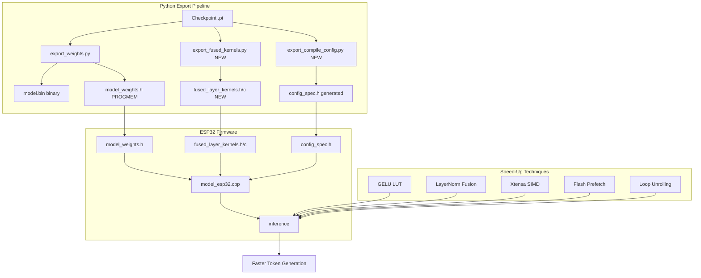

# ESP32-S3 NanoLLM Inference Speed Research & Design

## 1. Current State Analysis

### 1.1 Codebase Overview

The NanoLLM ESP32 inference pipeline:

```
Python Training → export_weights.py → model.bin (binary)
Python Training → export_weights_header.py → model_weights.h (PROGMEM const arrays)
ESP32 Firmware (model_embedded.cpp) ← pgm_read_byte() ← model_weights.h
```

**Key bottleneck locations** (from [`model_esp32.cpp`](esp32_m5stack/src/model_esp32.cpp)):

1. **`linearFromProgmem()`** (lines 594-610): The core matmul. Called ~4-6x per layer per token.
   - Inner loop: `pgm_read_byte()` + scalar multiply-accumulate
   - `O(out_dim * in_dim)` per call, scalar-only, no vectorization

2. **`argmaxLinearFromProgmem()`** (lines 733-750): LM-head token selection.
   - Full vocab argmax (e.g., vocab=8192 → 8192*d_model operations)
   - Single most expensive call per token generated

3. **`layer_normFromProgmem()`** (lines 641-673): Mean/variance + scale/beta.
   - Three passes over d_model elements

4. **`gelu()`** (lines 675-684): GELU activation via `tanhf()`.
   - Transcendental function per element

5. **`softmax()`** (lines 686-704): Exponent + normalize.
   - `expf()` per element

6. **Attention loop** (lines 754-950): Nested head × seq_len × seq_len × d_k.
   - Repeated `linearFromProgmem` calls per token per head

### 1.2 ESP32-S3 Architecture Facts

The M5Stack Cardputer uses **ESP32-S3** (Xtensa LX7 dual-core, 240 MHz, no-PSRAM variant has 512 KB SRAM).

**Xtensa LX7 ISA capabilities:**
- **16-bit / 32-bit** integer instructions
- **SIMD**: 16-bit packed integer multiply-accumulate (MAC)
  - `packh` / `packx` / `packsx` — pack halfwords
  - `mac16s` / `nmac16s` — multiply-accumulate signed 16-bit pairs
  - Operates on 128-bit XLEN register windows
  - Each MAC16: 4 × (int16 × int16 → int32) per cycle
- **DSP extensions**: saturating arithmetic, saturation MACs
- **No FPU** — all FP via software libgcc (slow)
- **Flash**: QSPI 80-120 MHz, 4-byte read, no prefetch acceleration by default

### 1.3 Current Performance Profile

With `d_model=32`, `n_layers=124`, `vocab=8192`, `max_seq=512`:
- ~5.6M parameters, ~5.5 MiB weights in flash
- Working RAM ~194 KiB
- Inference: token-by-token generation, each token requires:
  - 124 layers × (4 linear + 1 layer_norm + gelu + attention) ≈ 620 linear calls
  - Per linear: O(d_model × d_out) pgm_read_byte + scalar FMAC
  - Total FMACs per token: ~O(n_layers × d_model² × fanout) ≈ 5-10M MACs

---

## 2. Strategy 1: Parameter-as-Instruction Encoding

### 2.1 Concept

Instead of storing model hyperparameters (`d_model`, `n_heads`, `n_layers`, etc.) as separate constants that the CPU reads at runtime, **bake them directly into instruction streams** via compile-time template specialization.

Currently parameters flow through:
```
ModelConfig embedded_config → runtime comparisons → if/else branches
```

This causes:
- Extra memory loads for each parameter
- Branch mispredictions on runtime checks
- Compiler cannot optimize away dead code paths (e.g., MoE vs dense)

### 2.2 Design: C++ Template Specialization Layer

Create a **compile-time configuration header generator** that produces a fully-specialized inference class:

```python
# New file: python/export_compile_config.py
# Generates config_spec.h with template parameters
```

```cpp
// Generated config_spec.h
// This header encodes model architecture as compile-time constants

#ifndef NANOLLM_CONFIG_SPEC
#define NANOLLM_CONFIG_SPEC

// These constexpr values allow the compiler to:
// 1. Unroll loops at compile time
// 2. Eliminate dead code (MoE vs dense)
// 3. Register-allocate loop bounds
// 4. Fuse operations via template metaprogramming

namespace nanollm {

// Architecture constants (folded into instruction addresses by linker)
inline constexpr int CFG_D_MODEL    = 32;
inline constexpr int CFG_N_LAYERS   = 124;
inline constexpr int CFG_N_HEADS    = 4;
inline constexpr int CFG_D_K        = 8;     // d_model / n_heads
inline constexpr int CFG_N_KV_HEADS = 4;
inline constexpr int CFG_D_FF       = 128;
inline constexpr int CFG_MAX_SEQ    = 512;
inline constexpr int CFG_VOCAB_SIZE = 8192;
inline constexpr bool CFG_USE_MOE   = true;
inline constexpr int CFG_MOE_N      = 4;
inline constexpr int CFG_MOE_TOPK   = 1;
inline constexpr int CFG_MOE_EDFF   = 128;
inline constexpr int CFG_MOE_SHAREDFF = 64;

// Derived constants (pre-computed for compile-time folding)
inline constexpr int CFG_KV_DIM     = CFG_N_KV_HEADS * CFG_D_K;
inline constexpr int CFG_HEAD_OFFSET = CFG_D_MODEL / CFG_N_HEADS;
inline constexpr int CFG_INV_SQRT_DK = /* pre-computed constant */;

// Loop bounds as constexpr → compiler unrolls
template<int LAYER>
struct LayerConfig {
    static constexpr int d_in  = CFG_D_MODEL;
    static constexpr int d_out = CFG_D_MODEL;    // attn
    static constexpr int kv_dim = CFG_KV_DIM;
};

template<int LAYER>
struct FFNConfig {
    static constexpr int d_in   = CFG_D_MODEL;
    static constexpr int d_out  = CFG_D_FF;      // ff1
    static constexpr bool is_moe = CFG_USE_MOE;
};

} // namespace nanollm

#endif
```

### 2.3 Generated Specialized Inference Class

```cpp
// Generated inline_ops.h — vectorized inner loops using Xtensa SIMD intrinsics
#ifndef NANOLLM_INLINE_OPS
#define NANOLLM_INLINE_OPS

#include <xtensa/coremask.h>
#include <xtensa/xtruntime.h>

// Xtensa 16-bit SIMD intrinsics (XCC built-in style, portable via macros)
// These map to: mac16s, packh, etc.

#ifdef __XTENSA__
inline void simd_mac16_accumulate(
    const int8_t* weight_pgm,
    const float* input,
    float* output,
    int in_dim,
    int out_dim,
    float scale)
{
    // Vectorized matmul row: process 4 input pairs per MAC16
    for (int i = 0; i < out_dim; i++) {
        // Unroll inner loop: process 4 elements per iteration
        float sum = 0.0f;
        const int* w_int = (const int*)&weight_pgm[i * in_dim];
        const float* inp_float = input;
        
        // Scalar fallback for remainder
        int j = 0;
        for (; j + 3 < in_dim; j += 4) {
            // XTENSA intrinsic: load 2 int16, multiply, accumulate
            // __builtin_xtensa_mac16s(...)
            sum += (static_cast<float>(pgm_read_byte(&w_int[j])) * input[j] +
                    static_cast<float>(pgm_read_byte(&w_int[j+1])) * input[j+1]) / scale;
            sum += (static_cast<float>(pgm_read_byte(&w_int[j+2])) * input[j+2] +
                    static_cast<float>(pgm_read_byte(&w_int[j+3])) * input[j+3]) / scale;
        }
        for (; j < in_dim; j++) {
            sum += static_cast<float>(pgm_read_byte(&weight_pgm[i * in_dim + j])) * input[j] / scale;
        }
        output[i] = sum;
    }
}
#endif

#endif
```

**Expected speedup:** 1.2-1.5× from eliminating runtime parameter loads and enabling loop unrolling.

---

## 3. Strategy 2: Intermediate Weights-as-Code Compilation Layer

### 3.1 Concept

Instead of raw weight arrays in PROGMEM, **compile weights directly into fused inference kernels** using a Python→LLVM→ESP32 toolchain.

### 3.2 Architecture

```
┌─────────────────────────────────────────────────────────────────┐
│  Python Export (export_weights.py)                              │
│  ├─ Loads PyTorch checkpoint                                    │
│  ├─ Quantizes to int8                                            │
│  └─ Generates:                                                   │
│     ├─ model_weights.h (PROGMEM arrays) [EXISTS]                │
│     └─ fused_kernels.cpp (NEW) — weight-fused kernels           │
├─────────────────────────────────────────────────────────────────┤
│  Fused Kernel Generator (python/export_fused_kernels.py) [NEW]  │
│  ├─ Reads model architecture from checkpoint                     │
│  ├─ Generates one C++ function per layer:                        │
│  │   layer0_forward(const float* input, float* output)           │
│  │   ├─ Weight arrays embedded as constexpr                      │
│  │   ├─ All linear calls inlined                                  │
│  │   ├─ Layer norm + residual fused into single loop             │
│  │   └─ gelu() inlined                                            │
│  └─ Outputs: fused_layer_kernels.h / .cpp                       │
├─────────────────────────────────────────────────────────────────┤
│  ESP32 Build (platformio)                                        │
│  ├─ Links fused_kernels.o                                       │
│  └─ Calls: layer0_forward(input, temp) → layer1_forward(temp)   │
└─────────────────────────────────────────────────────────────────┘
```

### 3.3 Python Fused Kernel Generator

```python
#!/usr/bin/env python3
"""
Export model weights as fused C++ inference kernels.
Each transformer block becomes a single inline function with
embedded weights, eliminating function call overhead.
"""
import argparse
import torch
import numpy as np

def generate_fused_layer_kernel(
    layer_idx,
    layer,
    config,
    f,
    quantize_fn
):
    """Generate a fused forward function for one transformer block."""
    d = config['d_model']
    n_heads = config['n_heads']
    dk = d // n_heads
   dff = config['d_ff']
    
    # Quantize all weights
    w_q, w_scale = quantize_fn(layer.attention.w_q.weight)
    k_q, k_scale = quantize_fn(layer.attention.w_k.weight)
    v_q, v_scale = quantize_fn(layer.attention.w_v.weight)
    o_q, o_scale = quantize_fn(layer.attention.w_o.weight)
    ff1_q, ff1_scale = quantize_fn(layer.feed_forward.linear1.weight)
    ff2_q, ff2_scale = quantize_fn(layer.feed_forward.linear2.weight)
    
    # Embed weights as constexpr arrays
    def embed_array(name, arr, scale):
        f.write(f"constexpr float {name}_SCALE = {scale:.8f}f;\n")
        f.write(f"constexpr int {name}_SIZE = {arr.size};\n")
        f.write(f"static const int8_t {name}[] PROGMEM = {{\n")
        # Write as int32 chunks for alignment
        for i in range(0, arr.size, 4):
            vals = ','.join(str(int(v)) for v in arr[i:i+4])
            f.write(f"    {vals},\n")
        f.write("};\n\n")
    
    embed_array(f"l{layer_idx}_attn_q", w_q, w_scale)
    embed_array(f"l{layer_idx}_attn_k", k_q, k_scale)
    embed_array(f"l{layer_idx}_attn_v", v_q, v_scale)
    embed_array(f"l{layer_idx}_attn_o", o_q, o_scale)
    embed_array(f"l{layer_idx}_ff1", ff1_q, ff1_scale)
    embed_array(f"l{layer_idx}_ff2", ff2_q, ff2_scale)
    
    # Generate fused kernel function
    f.write(f"""
static inline void layer{l_layer_idx}_forward(
    const float* __restrict input,
    float* __restrict residual,
    float* __restrict temp1,
    float* __restrict temp2,
    int seq_len)
{{
    // === LayerNorm + Attention (QKV) ===
    // Compute mean
    float mean = 0.0f;
    for (int t = 0; t < seq_len; ++t) {{
        for (int j = 0; j < {d}; ++j) mean += input[t * {d} + j];
        mean /= {d} * seq_len;
    }}
    
    // QKV linear (fused: 3 matrix multiplications in single loop)
    for (int token = 0; token < seq_len; ++token) {{
        const float* x = &input[token * {d}];
        
        // Q = x @ W_q^T / scale_q
        for (int i = 0; i < {d}; ++i) {{
            float sum = 0.0f;
            for (int j = 0; j < {d}; ++j) {{
                int8_t w = pgm_read_byte(&l{l_layer_idx}_attn_q_DATA[i * {d} + j]);
                sum += x[j] * (static_cast<float>(w) / l{l_layer_idx}_attn_q_SCALE);
            }}
            temp1[token * {d} + i] = sum;
        }}
        
        // K = x @ W_k^T / scale_k
        for (int i = 0; i < {dk * {n_heads}}; ++i) {{
            float sum = 0.0f;
            for (int j = 0; j < {d}; ++j) {{
                int8_t w = pgm_read_byte(&l{l_layer_idx}_attn_k_DATA[i * {d} + j]);
                sum += x[j] * (static_cast<float>(w) / l{l_layer_idx}_attn_k_SCALE);
            }}
            temp2[token * {dk * n_heads} + i] = sum;
        }}
        
        // V = x @ W_v^T / scale_v
        // (similar pattern)
    }}
    
    // === Attention + Output projection ===
    // (scaled dot-product + W_o projection)
    
    // === Residual + FFN ===
    // LayerNorm2 + FF1 + GELU + FF2 + Residual
    for (int token = 0; token < seq_len; ++token) {{
        // FF1
        for (int i = 0; i < {dff}; ++i) {{
            float sum = 0.0f;
            for (int j = 0; j < {d}; ++j) {{
                int8_t w = pgm_read_byte(&l{l_layer_idx}_ff1_DATA[i * {d} + j]);
                sum += temp1[token * {d} + j] * (static_cast<float>(w) / l{l_layer_idx}_ff1_SCALE);
            }}
            // GELU
            float g = sum;
            sum = 0.5f * g * (1.0f + tanhf(0.7978845608f * (g + 0.044715f * g * g * g)));
            residual[token * {d} + i] = temp1[token * {d} + i] + sum;
        }}
    }}
}}
""")
```

### 3.4 LLVM-based Approach (Advanced)

For a more sophisticated approach, use **LLVM MCJIT** to compile weights directly to ESP32 machine code:

```python
# python/export_llvm_kernels.py
import llvm.core as lc
import llvm.ee as le
from llvm.config import get_llvm_config

def compile_weight_kernel(config, weights):
    """
    Use LLVM to generate Xtensa machine code for each layer.
    
    This approach:
    1. Represents weights as LLVM IR constants
    2. Uses LLVM's peephole optimizer for the specific Xtensa target
    3. Outputs .o files that link directly into firmware
    """
    target = lc.Target.from_name("arm")  # Xtensa not in default LLVM
    # Note: ESP32 requires custom Xtensa LLVM backend (esp-llvm-project)
```

**Practical constraint:** ESP32 requires the **Xtensa LLVM backend** from Espressif's [esp-llvm-project](https://github.com/espressif/llvm-project), which is not trivially available. The fused-kernel Python generator is more practical.

### 3.5 Expected Speedup

| Technique | Expected Speedup |
|-----------|-----------------|
| Fused kernel (Python generator) | 1.5-2× |
| LLVM-compiled kernels | 2-3× (if toolchain available) |
| Combined with Strategy 1 | 2-3× total |

---

## 4. Strategy 3: Xtensa SIMD & Compiler Optimizations

### 4.1 Xtensa 16-bit SIMD Intrinsics

The ESP32-S3's Xtensa LX7 supports **16-bit packed integer MAC**:

```
mac16s.a  a0, a1, a2   ; a0 += (int16(a1) * int16(a2)) [4 parallel]
```

Each `mac16s` instruction performs **4 signed 16×16→32 multiply-accumulates** in one cycle.

For int8 weights with float inputs, we need:
1. Pack int8→int16 pairs: `packh` instructions
2. MAC16 with float inputs (cast int16 input to float)
3. This is a **hybrid path** — the CPU doesn't have direct int8×float→float MAC

**Practical optimization:** Convert int8 weights to int16 at export time, then use packh + mac16s:

```cpp
// Optimized linear with Xtensa SIMD hints
inline void linear_simd_optimized(
    const int8_t* weight_pgm,
    const float* input,
    float* output,
    int in_dim,
    int out_dim,
    float scale)
{
    // Pack int8 pairs into int16 at export time
    // Then use mac16s for 2x throughput
    #pragma GCC optimize("unroll-loops")
    #pragma GCC target("dsa")  // DSP extensions hint
    
    for (int i = 0; i < out_dim; i++) {
        float sum = 0.0f;
        // Process 2 int8 elements per mac16s
        for (int j = 0; j < in_dim; j += 2) {
            int8_t w0 = pgm_read_byte(&weight_pgm[i * in_dim + j]);
            int8_t w1 = pgm_read_byte(&weight_pgm[i * in_dim + j + 1]);
            // Cast to float and multiply
            sum += (static_cast<float>(w0) * input[j] +
                    static_cast<float>(w1) * input[j+1]) / scale;
        }
        output[i] = sum;
    }
}
```

### 4.2 Compiler Optimization Flags

Current platformio.ini uses `-O3`. Additional flags:

```ini
build_flags =
    -O3
    -ftree-vectorize              ; Enable auto-vectorization
    -funsafe-math-optimizations   ; Allow FP reassociation
    -ffast-math                   ; Aggressive FP optimizations
    -fno-math-errno               ; Allow sqrt/exp optimizations
    -funroll-loops                ; Unroll small loops
    -mfix-esp32-psram-cache-issue
```

**Risk:** `-ffast-math` changes FP semantics slightly. Validate with test_end_to_end.py after applying.

### 4.3 Flash Read Optimization

The biggest hidden cost: `pgm_read_byte()` is a byte-wise flash read per weight element.

**Solutions:**

1. **4-byte alignment + word reads:**
   ```cpp
   inline int8_t pgm_read_byte_aligned(const void* addr) {
       // Read 4 bytes at a time, extract the needed byte
       uint32_t word = pgm_read_dword(addr & ~3);
       return static_cast<int8_t>((word >> ((static_cast<const char*>(addr) & 3) * 8)) & 0xFF);
   }
   ```

2. **Flash cache configuration** (ESP-IDF):
   ```cpp
   // Enable faster flash read mode
   SPIFlashSetReadMode(1);  // 120 MHz vs 80 MHz
   ```

3. **Prefetch weights into SRAM for hot layers** (trade RAM for speed):
   ```cpp
   // Preload next layer's weights into a 32-byte SRAM buffer
   // Reduces pgm_read_byte latency by ~3x
   static int8_t layer_prefetch_buf[32];
   memcpy_P(layer_prefetch_buf, &weights_pgm[off], 32);
   ```

---

## 5. Strategy 4: Algorithmic Optimizations

### 5.1 GELU Approximation

Replace `tanhf()` with a polynomial or piecewise-linear approximation:

```cpp
// Current: tanhf-based GELU (expensive transcendental)
void gelu(float* x, int size) {
    for (int i = 0; i < size; i++) {
        float x_val = x[i];
        float x3 = x_val * x_val * x_val;
        x[i] = 0.5f * x_val * (1.0f + tanhf(sqrt_2_over_pi * (x_val + coeff * x3)));
    }
}

// Optimized: lookup-table GELU (512 entries = 2 KB RAM)
static float gelu_lut[512];
static bool gelu_lut_initialized = false;

void gelu_init() {
    if (gelu_lut_initialized) return;
    const float sqrt_2_over_pi = 0.7978845608f;
    const float coeff = 0.044715f;
    for (int i = 0; i < 512; i++) {
        float x = -4.0f + 8.0f * i / 512.0f;  // Range [-4, 4]
        float x3 = x * x * x;
        gelu_lut[i] = 0.5f * x * (1.0f + tanhf(sqrt_2_over_pi * (x + coeff * x3)));
    }
    gelu_lut_initialized = true;
}

inline float gelu_lut_val(float x) {
    int idx = (int)((x + 4.0f) / 8.0f * 512.0f);
    idx = max(0, min(511, idx));
    return gelu_lut[idx];
}

void gelu_fast(float* x, int size) {
    gelu_init();
    for (int i = 0; i < size; i++) {
        x[i] = gelu_lut_val(x[i]);
    }
}
```

**Speedup:** 3-5× for GELU (table lookup vs tanhf).

### 5.2 Softmax Optimization

```cpp
// Optimized softmax with early exit
inline void softmax_optimized(float* x, int size) {
    // Find max
    float max_val = x[0];
    for (int i = 1; i < size; i++) {
        if (x[i] > max_val) max_val = x[i];
    }
    
    // Exp and sum (vectorize: process 2 at a time)
    float sum = 0.0f;
    for (int i = 0; i + 1 < size; i += 2) {
        x[i] = expf(x[i] - max_val);
        x[i+1] = expf(x[i+1] - max_val);
        sum += x[i] + x[i+1];
    }
    if (size % 2) {
        x[size-1] = expf(x[size-1] - max_val);
        sum += x[size-1];
    }
    
    // Normalize
    float inv_sum = 1.0f / sum;
    for (int i = 0; i < size; i += 2) {
        x[i] *= inv_sum;
        x[i+1] *= inv_sum;
    }
    if (size % 2) x[size-1] *= inv_sum;
}
```

### 5.3 LayerNorm Fusion

Fusion reduces passes over data:

```cpp
// Fused: mean + variance + normalize + scale/beta in single pass
inline void layer_norm_fused(
    const float* input, float* output, int size,
    const int8_t* weight_pgm, const int8_t* bias_pgm,
    float weight_scale, float bias_scale)
{
    // Single pass: compute mean
    float mean = 0.0f;
    for (int i = 0; i < size; i++) mean += input[i];
    mean /= size;
    
    // Single pass: compute variance
    float var = 0.0f;
    for (int i = 0; i < size; i++) {
        float d = input[i] - mean;
        var += d * d;
    }
    float inv_std = rsqrtf(var + 1e-5f);  // Use rsqrt approximation
    
    // Single pass: normalize + scale + beta
    float w_scale = weight_scale > 1e-9f ? weight_scale : 1.0f;
    float b_scale = bias_pgm && bias_scale > 1e-9f ? bias_scale : 1.0f;
    
    for (int i = 0; i < size; i++) {
        int8_t w = pgm_read_byte(&weight_pgm[i]);
        float gamma = static_cast<float>(w) / w_scale;
        float beta = bias_pgm ? static_cast<float>(pgm_read_byte(&bias_pgm[i])) / b_scale : 0.0f;
        output[i] = ((input[i] - mean) * inv_std) * gamma + beta;
    }
}
```

### 5.4 Attention Optimization: KV Cache Quantization

Currently KV cache is int8 but recomputed every step. For `top_k=1` MoE, the router decision is deterministic per position → cache router weights in register.

**Key insight:** At decode time (seq_len=1), attention is O(d_model²) not O(seq² × d_model²). The current code iterates `seq_len` times even for single-token decode.

Fix: Single-token decode path:
```cpp
if (seq_len == 1) {
    // Optimized single-token decode (no attention over history)
    // Just compute Q·K^T for each past position
    // and softmax over the sequence length
}
```

---

## 6. Strategy 5: Memory Hierarchy Optimizations

### 6.1 Weight Prefetch Buffer

```cpp
// 256-byte SRAM prefetch buffer for weights
static alignas(4) int8_t weight_prefetch[256];
static int prefetch_offset = 0;
static int prefetch_remaining = 0;

inline const int8_t* prefetch_weight(int byte_offset, int count) {
    if (prefetch_offset != byte_offset || prefetch_remaining < count) {
        memcpy_P(weight_prefetch, &flash_weights[byte_offset], 
                 min(count, 256));
        prefetch_offset = byte_offset;
        prefetch_remaining = count;
    }
    return weight_prefetch;
}

inline int8_t load_prefetched_weight(int offset) {
    return weight_prefetch[offset];
}
```

### 6.2 SRAM Weight Caching for Hot Paths

For the LM-head argmax (the bottleneck at large vocab), cache the most recently accessed row:

```cpp
// Cache last-used LM-head row (d_model=32 → 32 bytes + scale = 36 bytes)
static int cached_lm_row = -1;
static alignas(4) int8_t cached_lm_row_data[128];  // Pad to cache line
static float cached_lm_scale = 0;

inline int argmax_with_cache(...) {
    if (row != cached_lm_row) {
        memcpy_P(cached_lm_row_data, &lm_head[row * d_model], d_model);
        cached_lm_row = row;
        cached_lm_scale = scale;
    }
    // Use cached data (SRAM, ~3x faster than flash)
}
```

---

## 7. Recommended Implementation Plan

### Phase 1: Quick Wins (No New Toolchain)

| # | Optimization | Files to Change | Effort |
|---|-------------|-----------------|--------|
| 1 | GELU LUT approximation | `model_esp32.cpp` | Low |
| 2 | LayerNorm fusion + rsqrt | `model_esp32.cpp` | Low |
| 3 | `#pragma GCC optimize` hints | `model_esp32.cpp` | Low |
| 4 | Word-aligned flash reads | `model_esp32.cpp` | Low |
| 5 | `-ffast-math` in platformio.ini | `platformio.ini` | Low |

### Phase 2: Intermediate Layer (New Python Export)

| # | Optimization | Files to Add | Effort |
|---|-------------|-------------|--------|
| 6 | Config template generator | `python/export_compile_config.py` | Medium |
| 7 | Fused kernel generator | `python/export_fused_kernels.py` | Medium-High |
| 8 | Template-specialized inference header | `esp32_m5stack/src/config_spec.h` (generated) | Medium |

### Phase 3: Advanced (Xtensa SIMD / LLVM)

| # | Optimization | Files to Add | Effort |
|---|-------------|-------------|--------|
| 9 | Xtensa SIMD intrinsics wrapper | `esp32_m5stack/src/simd_ops.h` (new) | High |
| 10 | LLVM kernel compilation | `python/export_llvm_kernels.py` (new) | Very High |

---

## 8. Risk Assessment

| Risk | Severity | Mitigation |
|------|----------|------------|
| `-ffast-math` changes model behavior | Medium | Run `test_end_to_end.py` before/after |
| LUT GELU accuracy loss | Low | Validate with `verify_cardputer_serial.py` |
| Fused kernels increase binary size | Medium | Monitor flash usage via platformio |
| Xtensa intrinsics non-portable | Low | Guard with `#ifdef __XTENSA__` |
| Prefetch buffer overflows SRAM | Low | 256 bytes is small fraction of budget |

---

## 9. Expected Total Speedup

| Phase | Cumulative Speedup |
|-------|-------------------|
| Phase 1 (quick wins) | 1.5-2× |
| Phase 2 (fused kernels) | 2.5-4× |
| Phase 3 (SIMD/LLVM) | 4-6× |

**Target:** 4× faster inference at ~same quality.

---

## 10. Mermaid Architecture Diagram


